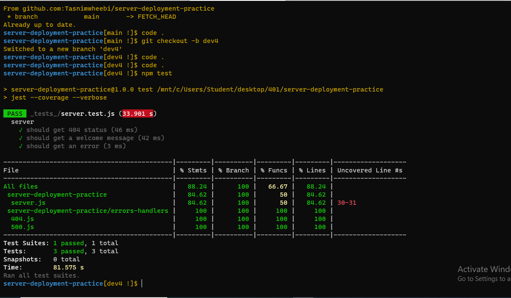
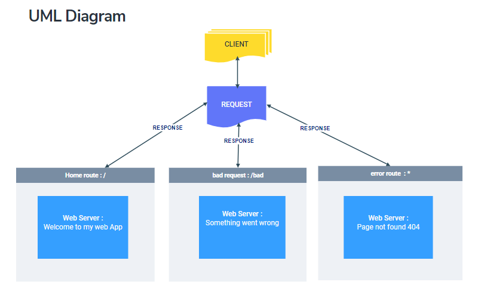

# server-deployment-practice

## lab-01 
* server-deployment-practice
## **Deployment Test**
## **Author: Tasnim Wheebi**

### heruko links :
* [Main](https://tasnim-server-deploy-prod.herokuapp.com/)
* [Dev](https://tasnim-server-deploy-dev.herokuapp.com/)

### action and pull request links :
* [Action link](https://github.com/Tasnimwheebi/server-deployment-practice/actions)
* [pull request](https://github.com/Tasnimwheebi/server-deployment-practice/pull/3 )

## **Setup**
.env requirements
* PORT - 3000

## **Running the app**
* npm start
* Endpoint: 
  * `/`
            
        Return Welcome to my web App

  * `/bad` 

          Something went wrong

  * `*`

        Page not found 404

### Tests
* **npm test**

 

 ## **UML**

